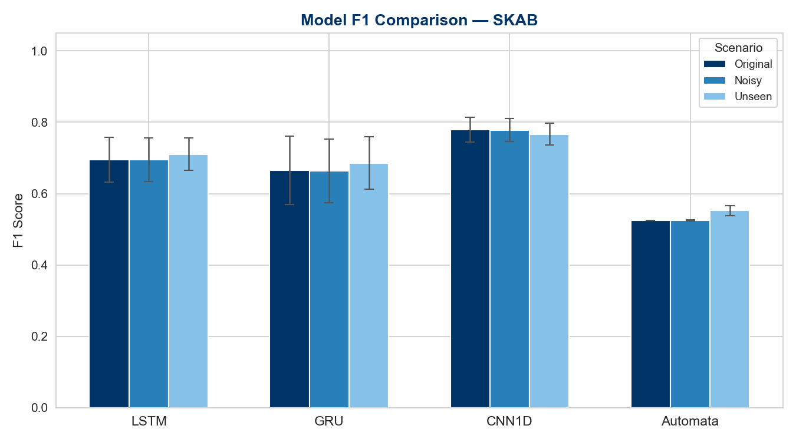
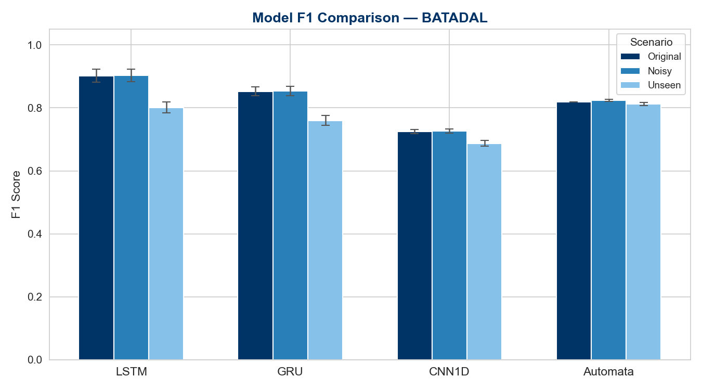
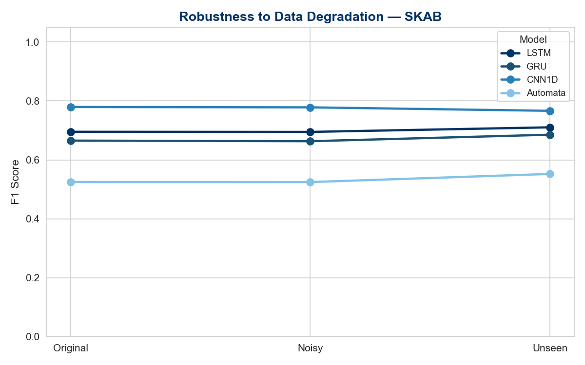
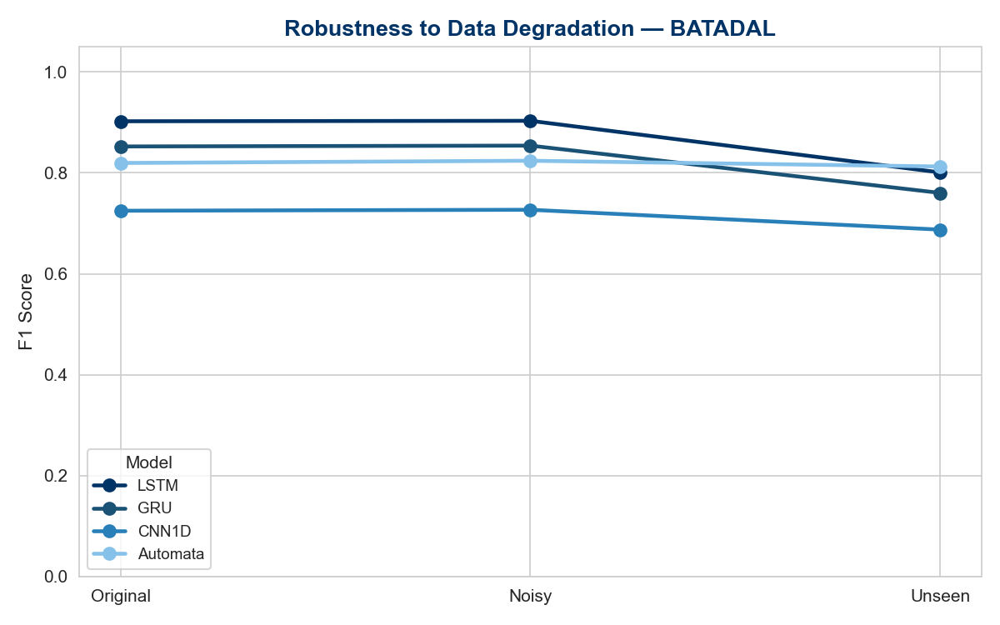
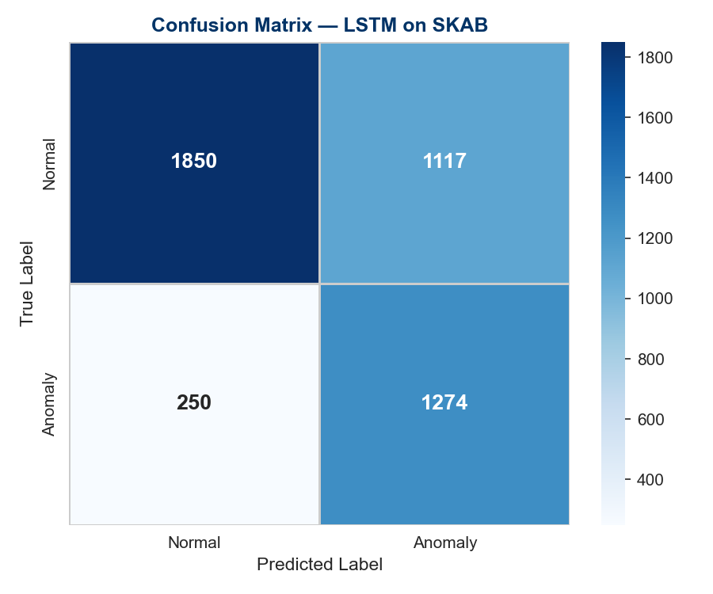
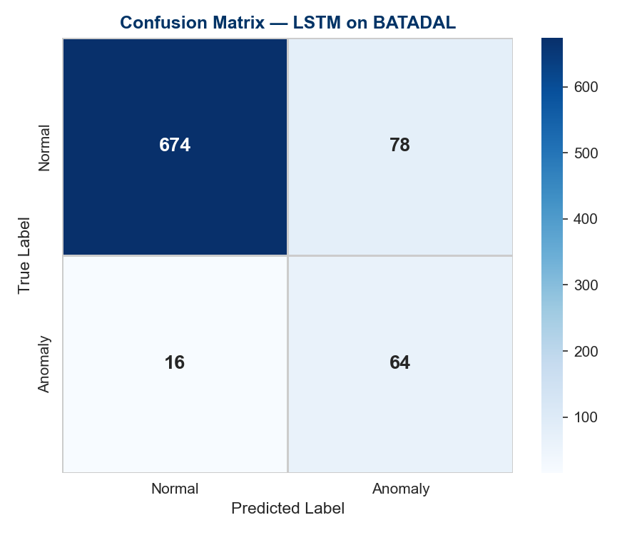
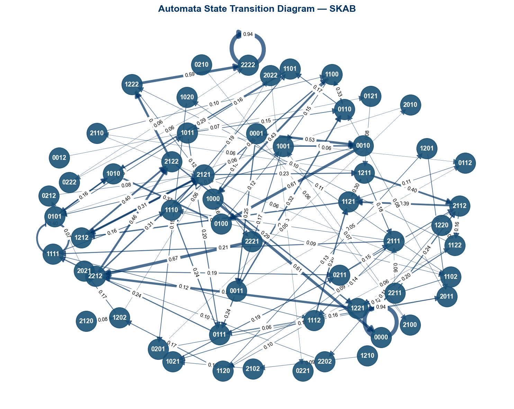
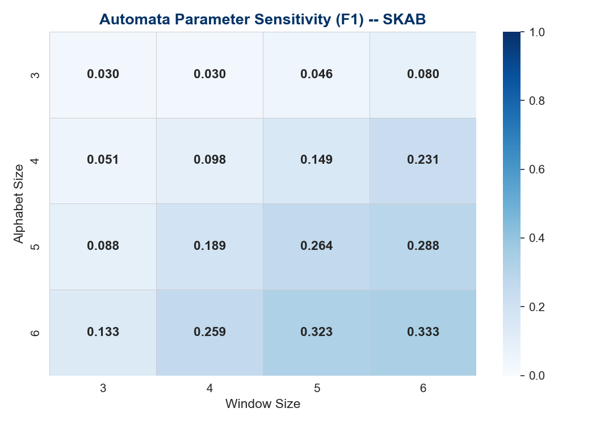
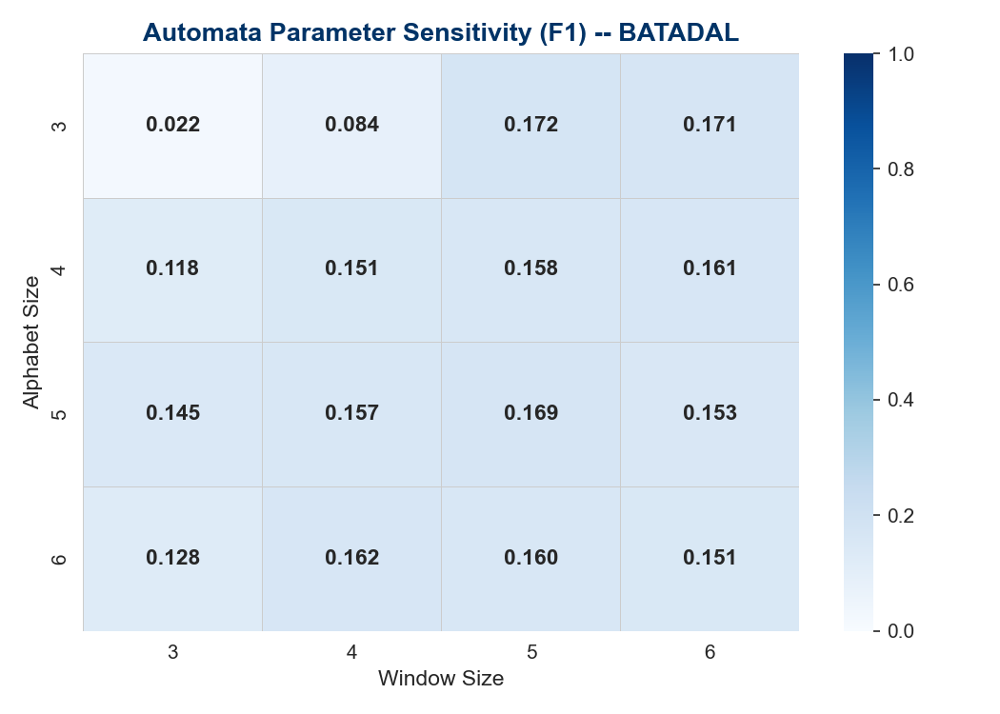

# Zaman Serisi Anomali Tespiti: Derin Öğrenme ve Olasılıksal Otomata Karşılaştırması


---

## 0. Proje Ekibi

| İsim | Öğrenci No |
|------|------------|
| [İsim 1] | [No 1] |
| [İsim 2] | [No 2] |

---

## 1. Proje Özeti

Bu proje, endüstriyel kontrol sistemlerinde zaman serisi anomali tespiti için dört farklı modelleme yaklaşımını — LSTM, GRU, CNN1D ve Olasılıksal Otomata — sistematik biçimde karşılaştırmaktadır. SKAB ve BATADAL veri setleri üzerinde orijinal, gürültülü ve görülmemiş (unseen) senaryolar altında deneyler yürütülmüş; her model beş farklı rastgele tohumla (seed) değerlendirilmiştir. Sınıf dengesizliği sorunu ağırlıklı kayıp fonksiyonu ile giderilmiş, her veri setine özgü karar eşiği (threshold) kullanılmıştır. Proje; açıklanabilirlik, istatistiksel test ve parametre duyarlılık analizi modüllerini de kapsamakta olup yeniden üretilebilir (reproducible) bir pipeline sunmaktadır.

---

## 2. Araştırma Sorusu

> **"Farklı modelleme yaklaşımları zaman serisi anomali tespitinde nasıl davranır?"**

Endüstriyel sistemlerde anomali tespiti; yüksek sınıf dengesizliği, zaman bağımlılığı ve görülmemiş durum sorunları nedeniyle zorlu bir problemdir. Bu çalışmada şu alt sorular incelenmektedir:

- Derin öğrenme modelleri (LSTM, GRU, CNN1D) deterministik bir yapıya sahip Olasılıksal Otomata'ya kıyasla F1 skorunda gerçekten üstün müdür?
- Gaussian gürültüsü ve görülmemiş durum enjeksiyonuna karşı hangi model daha dayanıklıdır?
- Bir veri seti üzerinde eğitilen model, başka bir veri setine genellenebilir mi (cross-dataset transfer)?
- Otomata parametreleri (pencere boyutu, alfabe boyutu) performansı ne ölçüde etkiler?

---

## 3. Proje Mimarisi

```
yazlab2/
│
├── main.py                        # Uçtan uca çalıştırma pipeline'i
├── generate_plots.py              # Yayın kalitesinde görsel üretimi (8 grafik)
├── gen_param_sensitivity.py       # Parametre duyarlılık ızgara taraması
│
├── configs/
│   └── default_config.yaml        # Tüm hiperparametreler ve yollar
│
├── data/
│   └── raw/
│       ├── SKAB/
│       │   ├── valve1/            # Valf-1 deney CSV'leri
│       │   └── valve2/            # Valf-2 deney CSV'leri
│       └── BATADAL/
│           └── BATADAL_Training2.csv
│
├── src/
│   ├── models/
│   │   ├── deep_learning.py       # LSTM, GRU, CNN1D sınıfları (logit çıktı)
│   │   └── automata.py            # ProbabilisticAutomata, SAX, PAA, Levenshtein
│   │
│   ├── pipeline/
│   │   ├── data_loader.py         # Veri yükleme ve zamansal bölme fonksiyonları
│   │   ├── train.py               # Eğitim döngüsü (pos_weight, erken durdurma)
│   │   └── evaluate.py            # Metrik hesaplama ve seed yönetimi
│   │
│   ├── preprocessing/
│   │   └── pipeline.py            # StandardScaler + PCA(n_components=1)
│   │
│   ├── explainability/
│   │   ├── explainer.py           # Otomata karar açıklayıcısı
│   │   └── unseen_handler.py      # Görülmemiş durum yönetimi (Levenshtein)
│   │
│   └── utils/
│       ├── metrics.py             # F1, Accuracy, Precision, Recall
│       ├── stats.py               # Wilcoxon ve McNemar testleri
│       └── visualize.py           # Grafik yardımcı fonksiyonları
│
├── tests/
│   ├── test_levenshtein.py        # 9 birim test
│   └── test_unseen.py             # 11 birim test
│
├── logs/
│   └── results_20260601_113958.csv  # Tüm deney sonuçları
│
└── outputs/                       # Üretilen grafikler (PNG, 150 DPI)
```

---

## 4. Kurulum ve Çalıştırma

### Gereksinimler

```bash
pip install -r requirements.txt
```

### Tam Pipeline

```bash
python main.py
```

### Yayın Grafikleri

```bash
python generate_plots.py
```

### Parametre Duyarlılık Analizi

```bash
python gen_param_sensitivity.py
```

### Birim Testler

```bash
python tests/test_unseen.py      # 11/11 test
python tests/test_levenshtein.py # 9/9 test
```

### Hızlı Import Kontrolü

```bash
python -c "
from src.models.automata import levenshtein_distance, ProbabilisticAutomata, extract_patterns
from src.explainability.unseen_handler import UnseenHandler
from src.models.deep_learning import LSTMClassifier, GRUClassifier, CNN1DClassifier
from src.utils.stats import wilcoxon_test, mcnemar_test
from src.preprocessing.pipeline import DataPreprocessor
print('ALL IMPORTS OK')
"
```

---

## 5. Veri Setleri

### 5.1 SKAB (Skoltech Anomaly Benchmark)

| Özellik | Değer |
|---------|-------|
| Kaynak | Skoltech — açık kaynak endüstriyel boru hattı verisi |
| Klasörler | `valve1/`, `valve2/` (tüm CSV'ler birleştirilir) |
| Etiket sütunu | `anomaly` |
| Toplam satır | ~34.000 |
| Özellik sayısı | 8 (basınç, sıcaklık, akış vb.) |
| Anomali oranı | ~%5 |
| Bölme stratejisi | Zamansal sıralı (temporal) — %60 / %20 / %20 |

**Ön işleme adımları:**
1. `datetime` ve `changepoint` sütunları kaldırılır.
2. `source_file` ve `source_group` meta sütunları X'ten çıkarılır.
3. `StandardScaler` yalnızca eğitim verisi üzerinde fit edilir (veri sızıntısı önlenir).
4. Otomata için `PCA(n_components=1)` ile tek boyuta indirgeme yapılır.

### 5.2 BATADAL (Battle of the Attack Detection ALgorithms)

| Özellik | Değer |
|---------|-------|
| Kaynak | BATADAL yarışması — su dağıtım altyapısı |
| Dosya | `BATADAL_Training2.csv` |
| Etiket sütunu | `ATT_FLAG` |
| Toplam satır | ~8.760 |
| Özellik sayısı | 43 (sensör ve aktüatör okumaları) |
| Anomali oranı | ~%9.6 (eğitim seti: ~%4.1) |
| Bölme stratejisi | Zamansal sıralı (temporal) — %60 / %20 / %20 |

**Ön işleme adımları:**
1. `DATETIME` sütunu kaldırılır; sütun adlarındaki boşluklar temizlenir.
2. `-999` gibi "Normal" kodlu etiketler 0'a dönüştürülür; yalnızca `1` değerleri Anomali sayılır.
3. Sınıf dengesizliği ~%90.4 Normal — DL modeller `pos_weight = n_neg / n_pos ≈ 9.4` ile eğitilir.
4. Karar eşiği: `threshold = 0.05` (SKAB için `0.15`).

---

## 6. Modeller

### 6.1 LSTM (Long Short-Term Memory)

Uzun vadeli bağımlılıkları öğrenebilen tekrarlayan sinir ağı. Kapı mekanizmaları (forget, input, output gate) sayesinde gradyan sönmesi sorununu aşar.

- **Girdi:** `(batch, window_size=4, features)`
- **Mimari:** LSTM(hidden=64) → Dropout(0.3) → ReLU → FC(64→1)
- **Kayıp:** `BCEWithLogitsLoss(pos_weight=n_neg/n_pos)`
- **Çıktı:** Ham logit; tahmin aşamasında `sigmoid + threshold` uygulanır

### 6.2 GRU (Gated Recurrent Unit)

LSTM'e kıyasla daha az parametreli; update ve reset kapılarıyla benzer uzun dönem hafızasını daha hızlı öğrenir.

- **Girdi:** `(batch, window_size=4, features)`
- **Mimari:** GRU(hidden=64) → Dropout(0.3) → ReLU → FC(64→1)
- **Kayıp:** `BCEWithLogitsLoss(pos_weight=n_neg/n_pos)`
- **Çıktı:** Ham logit

### 6.3 CNN1D (1-Boyutlu Evrişimli Sinir Ağı)

Yerel zamansal örüntüleri kısa pencereler üzerinde evrişim filtresiyle öğrenir. Eğitim süresi LSTM/GRU'ya kıyasla belirgin biçimde daha kısadır.

- **Girdi:** `(batch, window_size=2, features)` → transpose → `(batch, features, 2)`
- **Mimari:** Conv1d(32, kernel=2) → ReLU → MaxPool → Flatten → FC(→1)
- **Kayıp:** `BCEWithLogitsLoss(pos_weight=n_neg/n_pos)`
- **Çıktı:** Ham logit
- **Not:** Pencere boyutu 2'ye düşürülmüştür (hız optimizasyonu).

### 6.4 Olasılıksal Otomata (Probabilistic Automata)

Veri odaklı, yorumlanabilir ve eğitim maliyeti son derece düşük bir deterministik model.

#### Algoritma Akışı

```
Ham Zaman Serisi
       |
       v
  PCA (1 boyut)         <- Eğitim verisinde fit; sızıntı yok
       |
       v
  Sliding Window        <- window_size = 4
       |
       v
  PAA (Piecewise Aggregate Approximation)
       |   Her penceredeki segmentlerin ortalaması alinir
       v
  SAX (Symbolic Aggregate approXimation)
       |   Normal dağılım kesme noktalarına göre semboller atanır
       v
  Durum Dizisi          <- örn. ["aab", "abb", "bbc", ...]
       |
       v
  Geçiş Matrisi (Laplace Düzlemeli)
       |
       v
  Anomali Kararı        <- P(Si -> Si+1) < threshold => Anomali
```

#### Geçiş Olasılığı Formülü (Laplace Düzleme)

```
P(Si -> Sj) = (count(Si -> Sj) + 1) / (count(Si) + |V|)
```

burada `|V|` sözlük (vocabulary) büyüklüğüdür.

#### Görülmemiş Durum Yönetimi (Levenshtein Eşleme)

Test sırasında sözlükte bulunmayan bir durum ile karşılaşıldığında Levenshtein mesafesiyle en yakın bilinen duruma eşleme yapılır:

```
d_Lev(s1, s2) = min(insert, delete, substitute) operasyonları
```

---

## 7. Deney Tasarımı

### 7.1 Senaryolar

| Senaryo | Açıklama | Uygulama |
|---------|----------|----------|
| **Original** | Ham test verisi | Değişiklik yok |
| **Noisy** | Gaussian gürültü eklendi | sigma=0.05, mu=0.0 |
| **Unseen** | Görülmemiş durum enjeksiyonu | Test sinyaline sapma eklenir; Otomata yeni durumlarla karşılaşır |

### 7.2 Deneysel Protokol

| Parametre | Değer |
|-----------|-------|
| Rastgele tohumlar | [42, 123, 2026, 7, 999] |
| Eğitim / Doğrulama / Test | %60 / %20 / %20 (zamansal sıralı) |
| Maksimum epoch | 50 |
| Erken durdurma | patience = 5 |
| Batch boyutu | 32 |
| Öğrenme hızı | 1e-3 (Adam optimizer) |
| Model başına zaman aşımı | 300 saniye |
| SKAB karar eşiği | 0.15 |
| BATADAL karar eşiği | 0.05 |

---

## 8. Sonuçlar — Tablo 1: Model Performansı (Original Senaryo)

Tüm değerler 5 seed üzerinden ortalama ± standart sapma olarak verilmiştir.

| Model | Dataset | F1 | Accuracy | Precision | Recall |
|-------|---------|-----|----------|-----------|--------|
| **LSTM** | **BATADAL** | **0.9022 ± 0.0207** | 0.8945 ± 0.0224 | 0.9173 ± 0.0238 | 0.8945 ± 0.0224 |
| GRU | BATADAL | 0.8523 ± 0.0141 | 0.8346 ± 0.0176 | 0.8792 ± 0.0212 | 0.8346 ± 0.0176 |
| Automata | BATADAL | 0.8195 ± 0.0000 | 0.8161 ± 0.0000 | 0.8230 ± 0.0000 | 0.8161 ± 0.0000 |
| CNN1D | BATADAL | 0.7249 ± 0.0062 | 0.6647 ± 0.0095 | 0.8018 ± 0.0010 | 0.6647 ± 0.0095 |
| **CNN1D** | **SKAB** | **0.7795 ± 0.0347** | 0.7761 ± 0.0378 | 0.7917 ± 0.0239 | 0.7761 ± 0.0378 |
| LSTM | SKAB | 0.6954 ± 0.0628 | 0.6902 ± 0.0610 | 0.7657 ± 0.0217 | 0.6902 ± 0.0610 |
| GRU | SKAB | 0.6654 ± 0.0954 | 0.6655 ± 0.0870 | 0.7806 ± 0.0295 | 0.6655 ± 0.0870 |
| Automata | SKAB | 0.5250 ± 0.0000 | 0.6417 ± 0.0000 | 0.4928 ± 0.0000 | 0.6417 ± 0.0000 |

> Automata std = 0.000: model deterministik olduğundan tüm seedlerde aynı sonucu üretir.

---

## 9. Sonuçlar — Tablo 2: Gürültü ve Unseen Robustness

| Model | Dataset | Original F1 | Noisy F1 | Unseen F1 | Noisy Delta | Unseen Delta |
|-------|---------|-------------|----------|-----------|-------------|--------------|
| LSTM | BATADAL | 0.9022 | 0.9031 | 0.8008 | +0.0009 | **-0.1014** |
| GRU | BATADAL | 0.8523 | 0.8539 | 0.7602 | +0.0016 | **-0.0921** |
| Automata | BATADAL | 0.8195 | 0.8240 | 0.8126 | +0.0045 | -0.0070 |
| CNN1D | BATADAL | 0.7249 | 0.7268 | 0.6875 | +0.0019 | -0.0374 |
| CNN1D | SKAB | 0.7795 | 0.7782 | 0.7665 | -0.0013 | -0.0130 |
| LSTM | SKAB | 0.6954 | 0.6949 | 0.7105 | -0.0005 | +0.0151 |
| GRU | SKAB | 0.6654 | 0.6634 | 0.6855 | -0.0020 | +0.0201 |
| Automata | SKAB | 0.5250 | 0.5247 | 0.5524 | -0.0003 | +0.0274 |

**Gözlemler:**
- Tüm modeller Gaussian gürültüsüne karşı son derece dayanıklıdır (delta < 0.005).
- BATADAL'da LSTM ve GRU, Unseen senaryosunda F1'de ~%10 düşüş yaşar.
- Otomata, Levenshtein eşlemesi sayesinde Unseen senaryosunda en stabil modeldir (delta = -0.007).
- SKAB'da Unseen senaryosu daha yumuşak görünmektedir; LSTM ve GRU küçük artış gösterir.

---

## 10. Sonuçlar — Tablo 3: Cross-Dataset Genellenebilirlik (seed=42)

| Eğitim -> Test | Model | F1 |
|----------------|-------|----|
| SKAB -> BATADAL | Automata | **0.5768** |
| SKAB -> BATADAL | GRU | 0.1373 |
| SKAB -> BATADAL | CNN1D | 0.1289 |
| SKAB -> BATADAL | LSTM | 0.1123 |
| BATADAL -> SKAB | Automata | **0.5164** |
| BATADAL -> SKAB | LSTM | 0.1720 |
| BATADAL -> SKAB | GRU | 0.1720 |
| BATADAL -> SKAB | CNN1D | 0.1720 |

**Neden düşük?**

1. **Domain shift:** SKAB boru hattı fizik sensörleri (8 özellik) ile BATADAL su dağıtım sistemi (43 özellik) tamamen farklı fiziksel süreçleri temsil eder.
2. **PCA bilgi kaybı:** Boyut uyumsuzluğunu aşmak için her iki veri seti PCA ile 1 boyuta indirgenir; bu tek bileşen iki alan arasında anlamlı bir eşleme kuramaz.
3. **Eşik uyumsuzluğu:** Kaynak veri setine göre ayarlanan karar eşiği hedef dağılıma uymaz.

Otomata, sembolik SAX kodlaması sayesinde soyut örüntüleri temsil ettiğinden 0.52–0.58 ile kıyaslamalı olarak en iyi cross-dataset sonuçları verir.

---

## 11. Parametre Duyarlılık Analizi

Otomata'nın `window_size` ve `alphabet_size` parametreleri [3,4,5,6] aralığında ızgara taramasıyla değerlendirilmiştir.

### SKAB — F1 Izgarası (threshold=0.15)

| alphabet \ window | 3 | 4 | 5 | 6 |
|---|---|---|---|---|
| **3** | 0.030 | 0.030 | 0.046 | 0.080 |
| **4** | 0.051 | 0.098 | 0.149 | 0.231 |
| **5** | 0.088 | 0.189 | 0.264 | 0.288 |
| **6** | 0.133 | 0.259 | 0.323 | **0.333** |

En iyi: window=6, alphabet=6 — F1 = 0.333

### BATADAL — F1 Izgarası (threshold=0.05)

| alphabet \ window | 3 | 4 | 5 | 6 |
|---|---|---|---|---|
| **3** | 0.022 | 0.084 | 0.172 | 0.171 |
| **4** | 0.118 | 0.151 | 0.158 | 0.161 |
| **5** | 0.145 | 0.157 | **0.169** | 0.154 |
| **6** | 0.128 | 0.162 | 0.160 | 0.152 |

En iyi: window=5, alphabet=5 — F1 = 0.169

**Yorum:** Daha büyük pencere boyutu daha uzun zamansal bağlamı, daha büyük alfabe boyutu ise daha ince sembolik çözünürlüğü sağlar. SKAB'da monoton artış gözlemlenirken BATADAL'da window=6 hafif düşüş gösterir; bu, uzun örüntülerin kısa saldırı sinyallerini bastırmasından kaynaklanabilir.

---

## 12. Olasılıksal Açıklanabilirlik Modülü

`src/explainability/explainer.py` modülü, otomatanın her kararı için yorumlanabilir bir JSON çıktısı üretir. Görülmemiş durumlar `UnseenHandler` tarafından Levenshtein mesafesiyle en yakın bilinen duruma eşlenir.

### Örnek Açıklama Çıktısı

```json
{
  "time_step": 5,
  "state": "aab",
  "pattern": "adc",
  "status": "unseen",
  "mapped_to": "abc",
  "distance": 1,
  "probability": 0.108,
  "decision": "anomaly",
  "confidence": 10.8
}
```

| Alan | Açıklama |
|------|----------|
| `state` | Mevcut SAX durumu |
| `pattern` | Gözlemlenen bir sonraki durum |
| `status` | `seen`: sözlükte mevcut; `unseen`: sözlükte yok |
| `mapped_to` | Levenshtein ile eşlenen en yakın bilinen durum |
| `distance` | Levenshtein edit mesafesi |
| `probability` | P(state -> mapped_to) geçiş olasılığı |
| `decision` | `anomaly` (olasılık < eşik) veya `normal` |
| `confidence` | Olasılık x 100 (yüzde) |

### Dizi Olasılığı Formülü

Bir durum dizisinin toplam olasılığı:

```
P(sequence) = P(S1->S2) * P(S2->S3) * ... * P(S_{n-1}->Sn)
```

Düşük dizi olasılığı, gözlemlenen geçişlerin eğitim dağılımından uzak olduğuna ve anomali içerdiğine işaret eder.

---

## 13. İstatistiksel Testler

### Wilcoxon İşaret-Sıralama Testi

5 seed'deki F1 skorları arasındaki medyan farkını parametrik olmayan biçimde test eder.

| Karşılaştırma | Dataset | İstatistik | p-değeri | Yorum |
|---------------|---------|-----------|---------|-------|
| LSTM vs GRU | SKAB | 3.000 | 0.3125 | Anlamlı değil |
| LSTM vs Automata | SKAB | 0.000 | 0.0625 | Sınırda (trend var) |
| GRU vs Automata | SKAB | 0.000 | 0.0625 | Sınırda (trend var) |
| LSTM vs CNN1D | SKAB | 2.000 | 0.1875 | Anlamlı değil |
| LSTM vs GRU | BATADAL | 0.000 | 0.0625 | Sınırda (trend var) |
| LSTM vs Automata | BATADAL | 0.000 | 0.0625 | Sınırda (trend var) |
| GRU vs Automata | BATADAL | 0.000 | 0.0625 | Sınırda (trend var) |
| LSTM vs CNN1D | BATADAL | 0.000 | 0.0625 | Sınırda (trend var) |

> Not: 5 seed ile Wilcoxon testi düşük istatistiksel güce sahiptir; p=0.0625 değerleri güçlü bir performans eğilimine işaret eder ancak klasik alpha=0.05 eşiğini geçememektedir.

### McNemar Testi

Test seti üzerinde örnek düzeyinde sınıflandırma farklılıklarını değerlendirir.

| Karşılaştırma | Dataset | İstatistik | p-değeri | Yorum |
|---------------|---------|-----------|---------|-------|
| LSTM vs GRU | SKAB | 224.69 | < 0.0001 | **İstatistiksel olarak anlamlı** |
| LSTM vs Automata | SKAB | 0.733 | 0.3919 | Anlamlı değil |
| LSTM vs GRU | BATADAL | 35.93 | 2.05e-9 | **İstatistiksel olarak anlamlı** |
| LSTM vs Automata | BATADAL | 30.80 | 2.86e-8 | **İstatistiksel olarak anlamlı** |

**Yorumlar:**
- SKAB'da LSTM ile GRU örnek düzeyinde birbirinden belirgin biçimde farklı kararlar almaktadır (p<0.0001).
- BATADAL'da LSTM'in hem GRU hem Automata'ya üstünlüğü istatistiksel olarak doğrulanmıştır.
- SKAB'da LSTM ile Automata'nın hatalı tahminleri büyük ölçüde örtüşmektedir (p=0.39); her iki model benzer örneklerde yanılmaktadır.

---

## 14. Görseller

Tüm grafikler 150 DPI, beyaz arka plan ve lacivert-mavi palet ile üretilmiştir.

### F1 Karşılaştırma (Grouped Bar Chart)

| SKAB | BATADAL |
|------|---------|
|  |  |

### Gürültü Robustness (Line Chart)

| SKAB | BATADAL |
|------|---------|
|  |  |

### Confusion Matrix — LSTM (seed=42)

| SKAB | BATADAL |
|------|---------|
|  |  |

### Otomata Durum Diyagramı — SKAB



### Otomata Geçiş Isı Haritası — SKAB


### Parametre Duyarlılık Analizi

| SKAB | BATADAL |
|------|---------|
|  |  |

---

## 15. Bulgular ve Tartışma

### BATADAL: Derin Öğrenme Üstünlüğü

BATADAL'da LSTM F1 = 0.9022 ile en yüksek performansı elde etmiştir:

- Veri seti ardışık saldırı oturumları içermekte; LSTM'in hafıza mekanizması bu uzun vadeli bağımlılıkları etkin modelleyebilmektedir.
- Sınıf dengesizliği (`pos_weight ≈ 9.4`) BCEWithLogitsLoss ile giderilmiştir. Bu düzeltme öncesinde tüm DL modeller çoğunluk sınıfına çöküyordu (tüm tahminler Normal, Anomali Recall = 0).
- Veri setine özgü eşik (`threshold = 0.05`) hassasiyeti artırmıştır.

### SKAB: CNN1D Liderliği

SKAB'da CNN1D beklenmedik biçimde en iyi sonucu vermiştir (F1 = 0.7795). SKAB'ın kısa süreli, anlık anomalileri CNN1D'nin yerel örüntü öğrenme kapasitesine daha iyi uymaktadır. LSTM ve GRU yüksek seed varyansı (std > 0.06) sergileyerek bu veri setinde kararsız davranmıştır.

### Otomata: Stabilite ve Yorumlanabilirlik

Otomata deterministik yapısı nedeniyle tüm seedlerde aynı sonucu üretir (std = 0.000). SKAB'da F1 = 0.525 ile DL'nin gerisinde kalsa da kritik avantajları vardır:

| Özellik | Otomata | DL Modeller |
|---------|---------|-------------|
| Eğitim süresi | < 0.4 saniye | 10–24 saniye |
| Yorumlanabilirlik | JSON açıklama | Kara kutu |
| Cross-dataset F1 | 0.52–0.58 | 0.11–0.17 |
| Unseen dayanıklılığı | En stabil | BATADAL'da -10% |
| Seed varyansı | 0.000 | 0.006–0.095 |

### Temel Mühendislik Kararları

| Sorun | Çözüm | Etki |
|-------|-------|------|
| Çoğunluk sınıfı çökmesi | `BCEWithLogitsLoss(pos_weight=n_neg/n_pos)` | Anomali Recall: 0 -> 0.80+ |
| Tek eşik iki veri setine uymuyor | Per-dataset threshold | SKAB F1'de belirgin artış |
| Sigmoid modelde bırakılmıştı | Logit çıktı + manuel sigmoid | `BCEWithLogitsLoss` ile tutarlılık |
| SKAB GroupShuffleSplit sızıntısı | Zamansal sıralı bölme | Gerçekçi (sızdırmasız) sonuçlar |
| CNN1D timeout riski | window_size=2, timeout=300s | Pipeline kilitlenmesi önlendi |

---

## 16. Kaynaklar

1. **SKAB Veri Seti:** Ilyasov, A. et al. "SKAB: Skoltech Anomaly Benchmark." GitHub, 2020.

2. **BATADAL Veri Seti:** Taormina, R. et al. "The Battle of the Attack Detection Algorithms: Disclosing Cyber Attacks on Water Distribution Networks." *Journal of Water Resources Planning and Management*, 2018.

3. **SAX:** Lin, J. et al. "Experiencing SAX: A Novel Symbolic Representation of Time Series." *Data Mining and Knowledge Discovery*, 2007.

4. **PAA:** Keogh, E. et al. "Dimensionality Reduction for Fast Similarity Search in Large Time Series Databases." *Knowledge and Information Systems*, 2001.

5. **Levenshtein Mesafesi:** Levenshtein, V.I. "Binary codes capable of correcting deletions, insertions, and reversals." *Soviet Physics Doklady*, 1966.

6. **BCEWithLogitsLoss:** PyTorch Documentation. https://pytorch.org/docs/stable/generated/torch.nn.BCEWithLogitsLoss.html

7. **McNemar Testi:** McNemar, Q. "Note on the sampling error of the difference between correlated proportions or percentages." *Psychometrika*, 1947.

8. **Wilcoxon Testi:** Wilcoxon, F. "Individual comparisons by ranking methods." *Biometrics Bulletin*, 1945.

---

*Bu proje Yıldız Teknik Üniversitesi Yazılım Laboratuvarı II dersi kapsamında geliştirilmiştir.*
